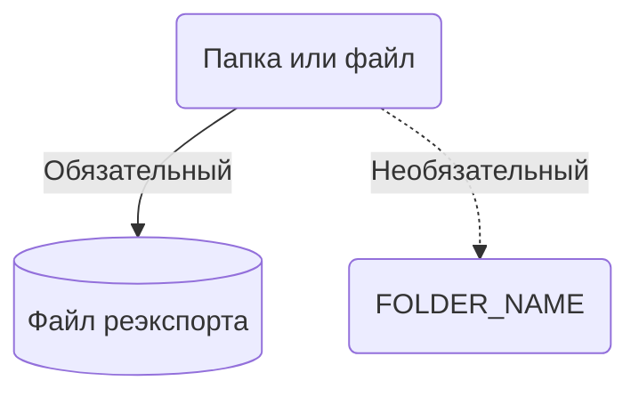
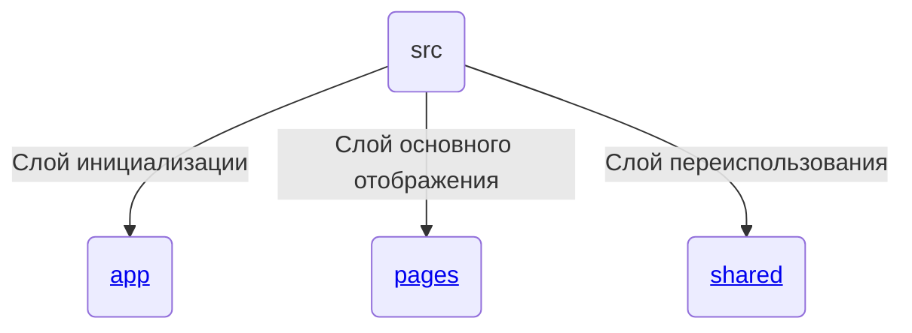

# Документация для \<vue-boilerplate>
Построен на базе Vue 3 на синтаксисе setup, в комбинации Vite + Typescript
## Пакетный менеджер
Вы можете использовать любой который вам подходит, так как в проекте стоит **package-lock=false** что означает нету лок файла (Если это станет проблемой то рекомендуется убрать это значение)

> Основные команды
```bash
# Init Project
npm i

# Start Dev
npm run dev

# Check lint for all project
npm run lint
```
Рекомендуется использовать: **npm**
#### Важно
При обновления или добавления пакета нужно ставить префикс "-E" чтобы в проекте были только фиксирование версии
```bash
npm i vue -E
```
> Плохо: "vue": "^3.0.0"

> Хорошо: "vue": "3.0.0"
## Env
> Основной env который попадает в GIT
```bash
# file: .env
APP_DOCKERMODE= # Base URL it's a - /webapps/
APP_BASE_PATH= # Mode for docker
```
> Локальный env в котором можно хранить настройки окружения (например токен и путь для генерации типов GraphQL...)
### Env Variable DEV
```bash
# file: .env.local
CODEGEN_API= # Path for gql generator
CODEGEN_TOKEN= # Token for make request with gql generator
```

## Генерация типов для GraphQL
Нужно настроить два параметра которые описаны выше в файле **.env.local**
> Запустить команду
```bash
npm run gql:gen
```
*Сгенерированная схема храниться по пути:* **src/shared/transports/schema**

Для работы автокомплита в файле *.gql* нужно поставить расширение Apollo GraphQL:

https://marketplace.visualstudio.com/items?itemName=apollographql.vscode-apollo

## EsLint и Prettier
EsLint и Prettier наследуется от двух библиотек, которые нужно будет обновлять и резолвить ошибки после обновления.
* @gumper-x/eslint-config
* @gumper-x/prettier-config

*Это нужно для поддержания единого стиля кода во всех проектах.*

## DI Container
    Глобальный объект со всеми зарегистрированными сервисами и доменами.

Во vue файле достать его можно через *Provide/Inject*.

Для это есть утилита injectScrict(Сюда нужно передать DI_KEY) теперь вам доступен di контеинер

## Архитектура
### Документация по графике

**Полоска с точками** - Необязательный (папки или файла).

**Полоска жирная** - Обязательная (папки или файла).

**Бочка** - Файл который собирает все что есть в папке и реэкспортит.

**UPPER_SNAKE_CASE** - имя для (папки или файла) вы даете сами.

### Основа - src 
    src --> Основная папка со Слоями
