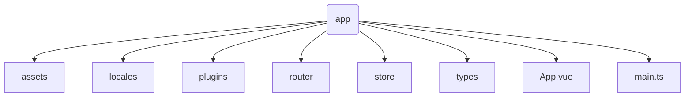
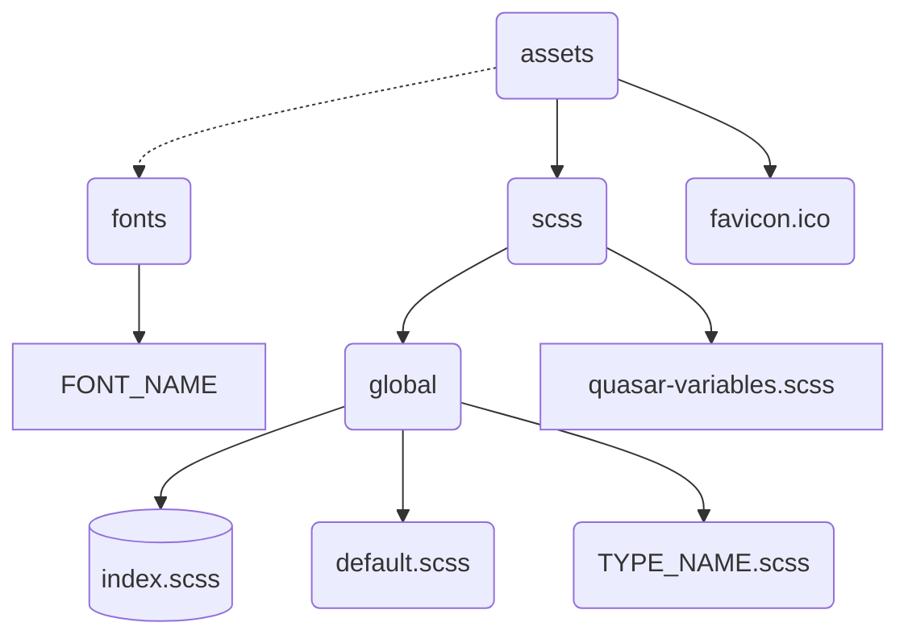
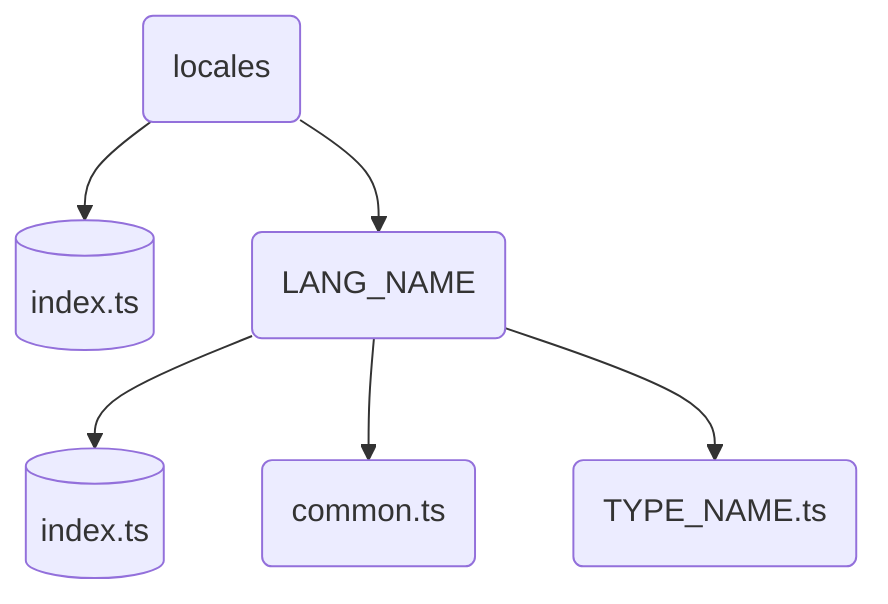
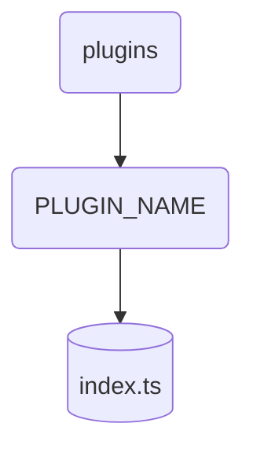
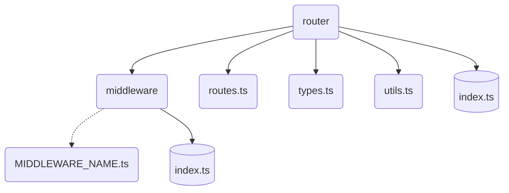
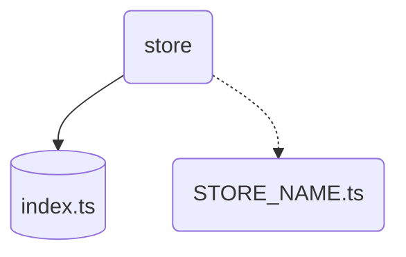
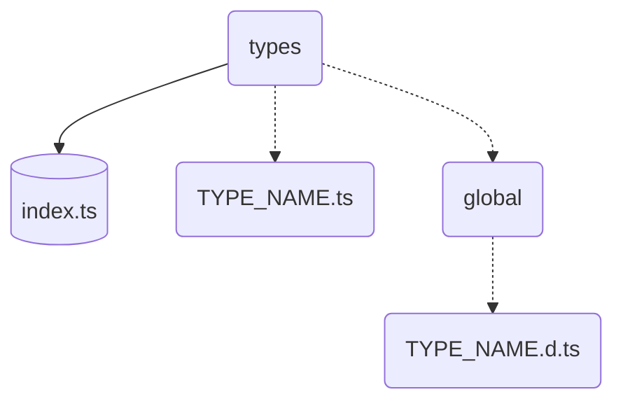

### Слой - app 
    app --> Слой инициализации приложения, тут все что запускается один раз или регистрируется глобально

    assets --> Слой для медиа файлов и прочего контента

    locales --> Слой хранения глобальной локализации

    plugins --> Слой регистрации плагинов

    router --> Слой роутинга

    store --> Слой роутинга
 - Глобальное хранения основана на **pinia** вместо *vuex*

    types --> Слой глобальных типов и регистрации пакетов

    App.vue --> Корневой vue файл, для инициализации приложения
***
    main.ts --> Корневой "RUN FILE" с которого запускается приложения и регистрируется плагины