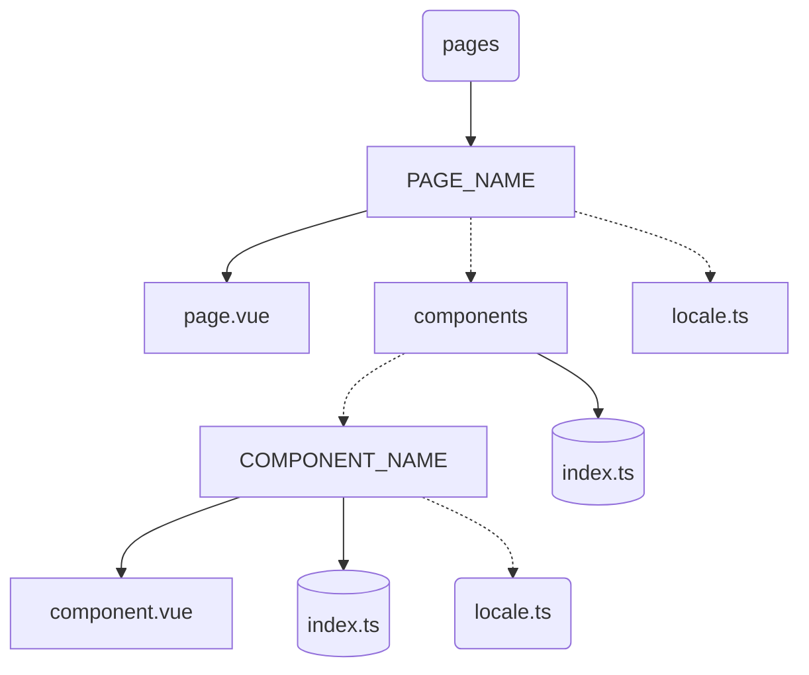

# Слой - pages
    pages --> Слой для удобного хранения страниц flat стиле *(не может быть две страницы в одной папке)*

 - *page* -- подгружается автоматически через функцию **loadPage()**

```mermaid
graph TD;
    id2(pages)-->PAGE_NAME;
    PAGE_NAME-->page.vue;
    PAGE_NAME-.->components;
    components-.->COMPONENT_NAME;
    components-->i[(index.ts)];
    COMPONENT_NAME-->component.vue;
    COMPONENT_NAME-->i2[(index.ts)];
    COMPONENT_NAME-.->i3(locale.ts);
    PAGE_NAME-.->locale.ts;
```