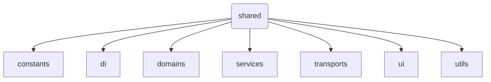
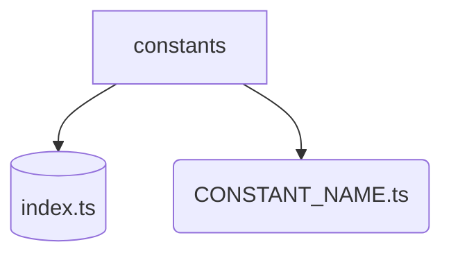
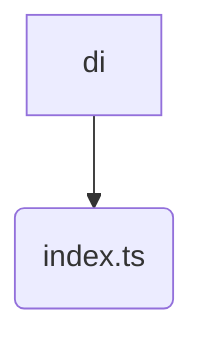
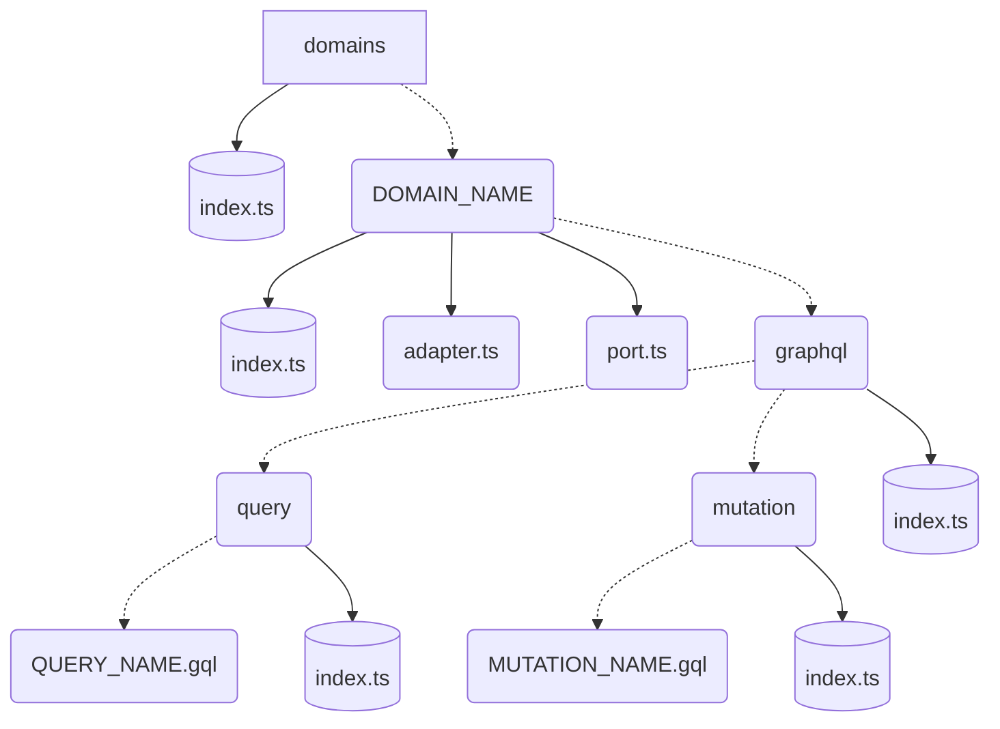
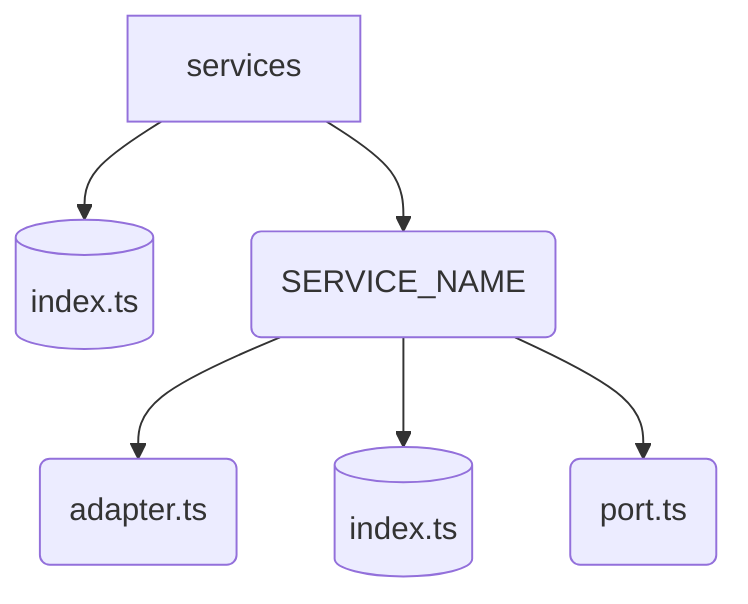
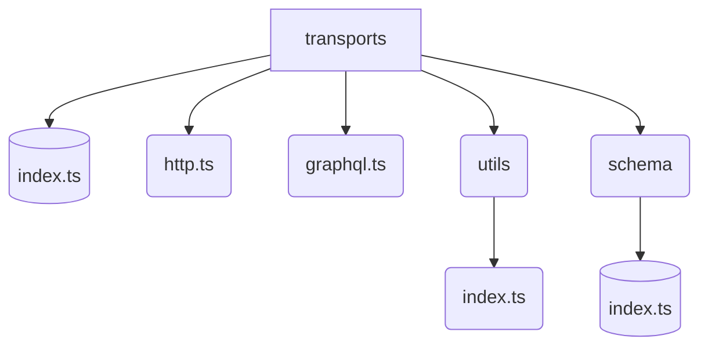
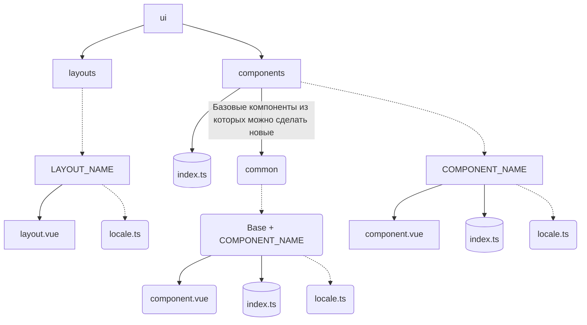
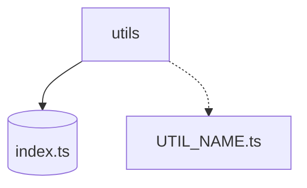

# Слой - shared
    shared --> Слой в котором можно хранить всю логику которая может быть использована во всех местах приложения

    constants --> Слой для всех постоянных значений

 - *Константы* -- неизменяемые константы должны быть названы в стиле UPPER_SNAKE_CASE

    di --> Слой регистрации всех сервисов и доменов

    domains --> Слой для доменов приложения

    services --> Слой сервисов которые не связанны с доменами

 - *Сервисы* -- не могут делать запросы или вызывать домен, они могут быть вызваны только в помощь к домену или внутри приложения

    transports --> Слой транспортных менеджеров

    ui --> Слой для общих компонентов и лейаутов

 - *layout* -- подгружается автоматически через функцию **loadLayout()**

    utils --> Слой для вспомогательных функций

